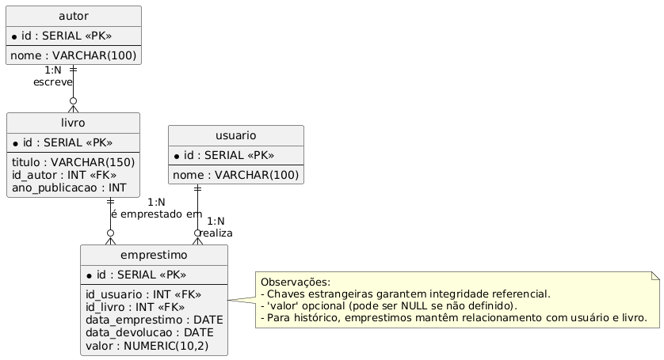

# 📚 Sistema de Biblioteca

Este projeto implementa um **sistema de biblioteca** em **PostgreSQL** com suporte a:

- Criação de tabelas com relacionamentos
- Procedures para operações comuns
- Views para consultas simplificadas
- Funções para lógica de negócio
- Modelo relacional documentado em PlantUML

---

## 🗂 Estrutura do Repositório

```
.
├── README.md
├── scripts/
│   ├── 01_schema.sql          # Criação das tabelas e inserts iniciais
│   ├── 02_views.sql           # Views para consultas
│   ├── 03_procedures.sql      # Procedures de manipulação
│   ├── 04_tests.sql           # Testes das procedures e views
│   └── 05_functions.sql       # Funções adicionais
└── docs/
    ├── modelo_relacional.md   # Explicação das tabelas e relacionamentos
    ├── modelo_relacional.puml # Diagrama em PlantUML
    ├── modelo_relacional.png  # Imagem do diagrama relacional
    └── decisoes_de_projeto.md# Justificativas das escolhas de implementação
```

---

## 🗃 Modelo Relacional

<p align="center">
  
</p>

---

## 🛠 Tecnologias Utilizadas
- **PostgreSQL** (Banco de Dados)
- **PL/pgSQL** (Procedures e Funções)
- **PlantUML** (Diagrama Relacional)

---

## 👨‍🎓 Autor
- Nome: **João Pedro Balduino Leitão**  
